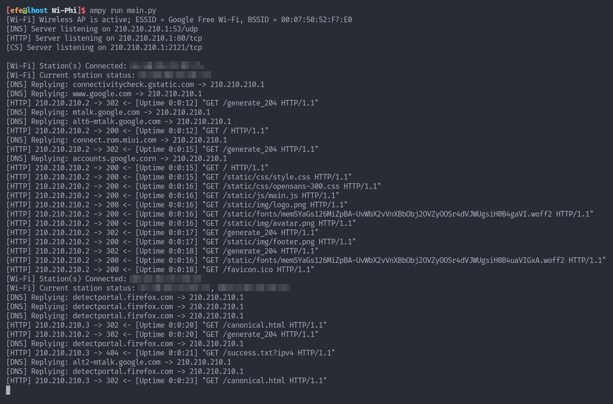
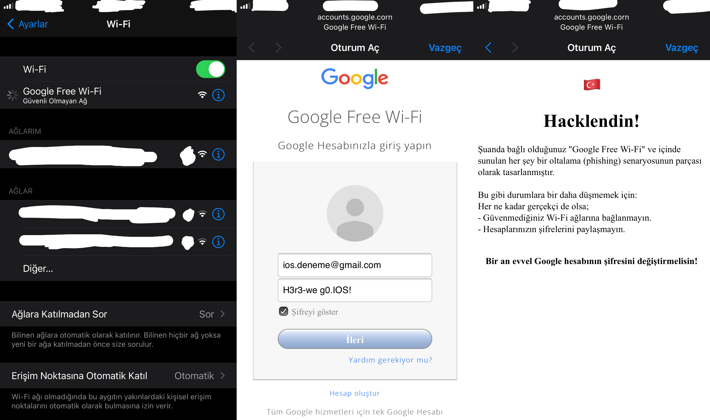
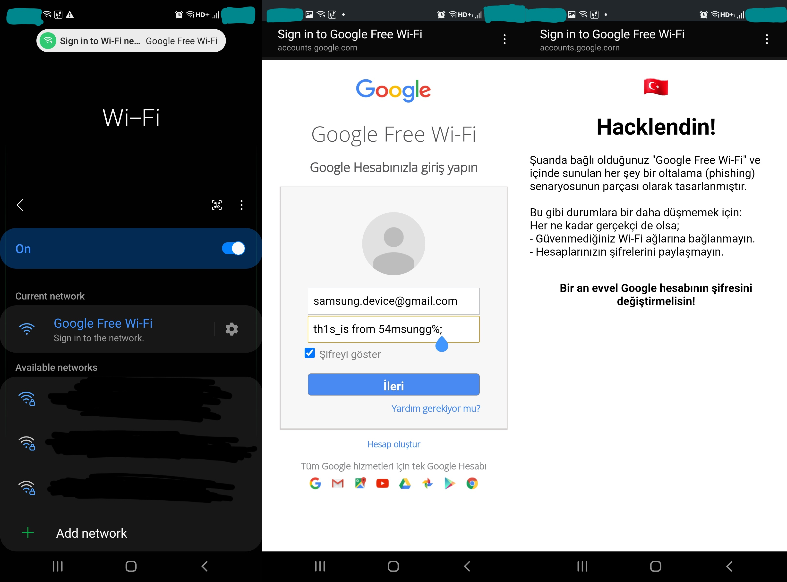
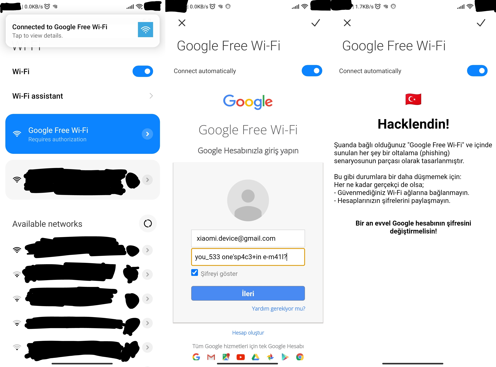
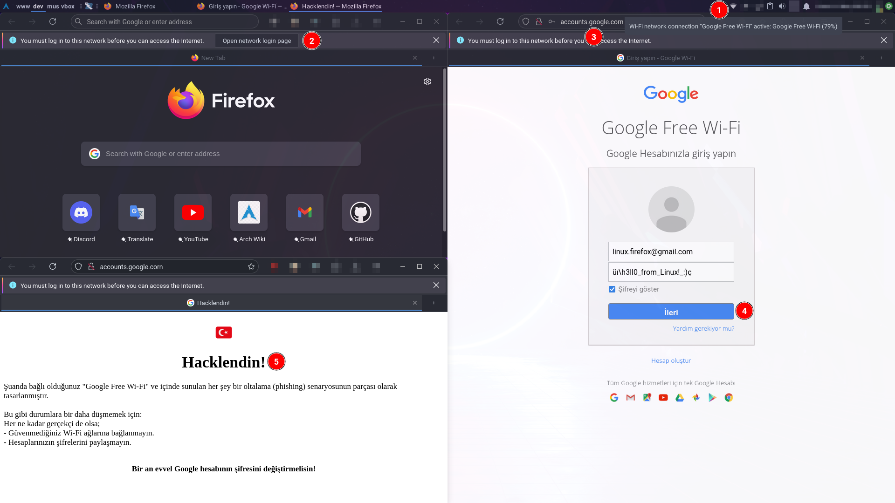
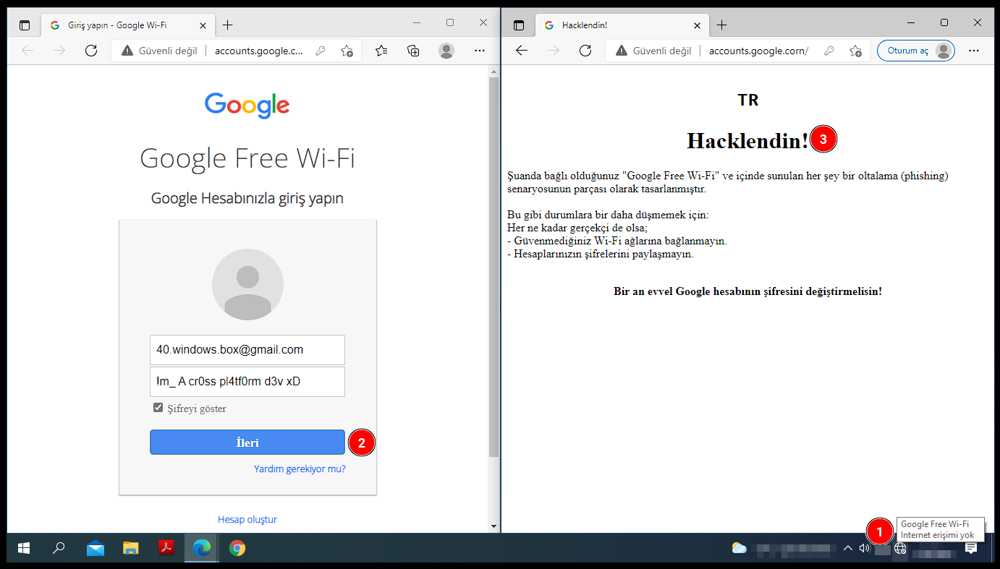
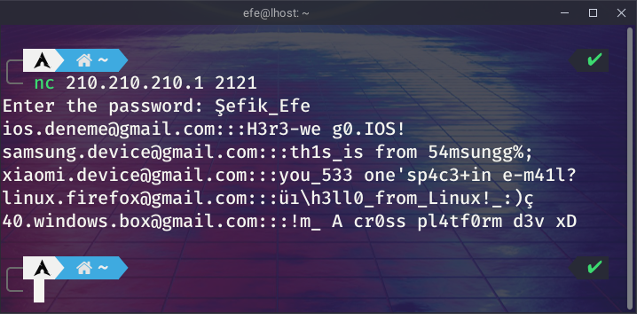

# Wi-Phi
─ ___An IoT Integrated Fully Automatic WIreless PHIshing System by Şefik Efe Altınoluk___ ─

## Legal Disclaimer
Do not try this software on the users/systems that you have no legal permission. Usage of `Wi-Phi` for attacking targets without prior mutual consent is illegal. It is the end user's responsibility to obey all applicable local, state and federal laws. I assume no liability and are not responsible for any misuse or damage caused by this software, documentation and anything in this repository.

## READ THIS ETHICAL NOTICE
__(SEE [#4](https://github.com/f4T1H21/Wi-Phi/issues/4#issuecomment-1645622242))__ Because `Wi-Phi` can be used maliciously, I don't share most parts of the source code. [Contact me](https://www.linkedin.com/in/%C5%9Fefik-efe/) from LinkedIn for any business/academical/educational cases in which you need the whole working code.

## LICENSE
This project is licensed under the Gnu General Public License Version 3.0<br>
See [LICENSE](LICENSE) for more details.

## About the Project
__`Wi-Phi`__ is an automatic `phishing` `system` fully integrated to  wireless `IoT` (Internet of Things) boards.<br>
It can be thought like an advanced, feature-rich `Wifi Pineapple`.<br>
__`Wi-Phi`__ is able to phish users who run at least one of the following softwares:

- IOS
- Android
- Windows
- Firefox

Main components of `Wi-Phi` are:
- An IoT board that supports `MicroPython` firmware. I use [`Deneyap Kart`](https://deneyapkart.org/) based on `ESP32`.
- The MicroPython firmware: `esp32-20220117-v1.18.bin`
- And the software above

## Getting Started
1. Obtain an ESP32 IoT device.
2. Connect ESP32 to your computer and get the serial port that the ESP32 is connected on.
    - For Windows, it is `COMx`
    - For GNU/Linux, it is either `/dev/ttyUSBx` or `/dev/tty/USBx`

3. Then run following commands for GNU/Linux.

```console
[efe@lhost ~]$ git clone https://github.com/f4T1H21/Wi-Phi.git && cd Wi-Phi
[efe@lhost Wi-Phi]$ pip3 install -r requirements.txt
[efe@lhost Wi-Phi]$ sudo ./setup.sh <serial_port>
```

4. Manually reboot ESP32 by pressing reset button on ESP32.

Now, the software should be working, check if you see a Wi-Fi network named `Google Free Wi-Fi`.<br>
Whenever you plug ESP32 to a power supply, the project runs automatically after the boot stage.<br>
[Nothing else matters](https://www.youtube.com/watch?v=x7bIbVlIqEc&t=295s).

## Project Overview
All the software is implemented on MicroPython, and runs on ESP32.<br>
ESP32 becomes a Wireless AP (Access Point); and runs three (3) independent sockets (on OSI Layer 4):
- `53/UDP` for `DNS` server
- `80/TCP` for `HTTP` server
- `2121/TCP` for `Credential Store` server

All binding is done on the gateway's (AP) IP address, which is `210.210.210.1`

The reason why I chose such an IP class is because for some reason, Samsung devices don't consider short IP addresses as captive portals. Which was a problem for me.

### Main Idea
The main idea is serving a static phishing website on an HTTP server and making this a `captive portal` for devices (stations) from any vendor that are connected over Wi-Fi.

#### Overview in OSI model:
- `Static site` served by HTTP server
- Layer 7: `DNS`, `HTTP` & `CS` servers
- Layer 4: `TCP` & `UDP` sockets for high-level protocols
- Layer 3: `Gateway`
- Layer 2: `LAN`
- Layer 1: `Wireless AP`, `Wi-Fi`

Below shows the well-designed scenario that `Wi-Phi` works under.


## Technical Documentation
This is also a case study that I assigned to myself. So let's dive into the case...

### How a Captive Portal works?
Most of the device vendors sends HTTP requests to their vendor-specific captive portal detection servers' certain endpoints and expects particular HTTP responses to understand if the Wi-Fi network has a captive portal or not.

Below table shows what to response for various device vendors, in order to make device suppose a captive portal exists in Wi-Fi network.<br>
__Note__: Mozilla is an exception to 'device vendors'. Firefox (as a browser) is able to make this decision itself according to its own captive portal detection server.

Responses with `302 Found` status code, also need to have a `Location:` header so as to redirect browser (client) properly.

|Device Vendor|Endpoints|Status Code|Response Body|
|-|-|-|-|
|Microsoft (Windows)|`www.msftconnecttest.com/ncsi.txt`|`200 OK`|`Microsoft NCSI`|
|Microsoft (Windows)|`www.msftconnecttest.com/connecttest.txt`|`200 OK`|`Microsoft Connect Test`|
|Microsoft (Windows)|`www.msftconnecttest.com/redirect`|`302 Found`||
|Google (Android)|`connectivitycheck.gstatic.com/gen_204`|`302 Found`||
|Google (Android)|`connectivitycheck.gstatic.com/generate_204`|`302 Found`||
|Google (Android)|`clients3.google.com/generate_204`|`302 Found`||
|Xiaomi|`connect.rom.miui.com/gen_204`|`302 Found`||
|Xiaomi|`connect.rom.miui.com/generate_204`|`302 Found`||
|Apple (IOS/MacOS)|`captive.apple.com/hotspot-detect.html`|`302 Found`||
|Mozilla (Firefox)|`detectportal.firefox.com/canonical.html`|`302 Found`||
|Mozilla (Firefox)|`detectportal.firefox.com/success.txt`|`302 Found`||

### The role of DNS Server
To be able to response the http requests that are done to above endpoints, these requests should be sent to ESP32's HTTP server. In order to achieve this, ESP32 should answer particular domain lookups to its own IP address.

- For example, the ip address for `google.com` should become `210.210.210.1`

So there need to be a Domain Name System Server running on ESP32. From this point of view, the scenerio looks similar to [DNS Hijacking](https://en.wikipedia.org/wiki/DNS_hijacking) attacks.

### Static Phishing page
I think Google is the most popular and trusted technology company world wide. So I prepared a static phishing page, which looks almost same to Gmail's old login page. And also named Wi-Fi network as `Google Free Wi-Fi`.

As the scenerio continues, after redirecting browser (client) to static login page, user is intended to enter his/her credentials and press next button. And the credentials is stored in a local file. Then user gets IP banned until next reboot of ESP32. Otherwise the local database can be messed up by dummy/wrong credentials. After all theese, client gets redirected to `/` directory of static site.
<br>
Whenever an IP banned client tries to access any resource on HTTP server, same html file [`hacklendin.html`](static/html/hacklendin.html) is being served regardless of HTTP request's method, head, body, etc.

### Credential Store
On the other side, local credential store can be viewed remotely by connecting to `2121/tcp` and authenticating with the hardcoded password while connected to Wi-Fi.

## Verbosing Activities
`Wi-Phi` is a feature-rich system. Verbose logs created by `Wi-Fi`, `HTTP` and `DNS` services can be viewed real-time. Theese logs are not stored locally to save storage.

To be able to see verbose logs,

1. Connect ESP32 to your computer using a USB cable.
2. Copy `boot.py`'s content to a local file named `main.py`.
3. Delete `boot.py` from ESP32 device.
4. Run `main.py` on ESP32.

You can use `ampy` tool for file operations and running software on ESP32.



## Proof of Concept
Let's take a look at a case that we have multiple independent devices from various vendors connected to our `Google Free Wi-Fi` at the same time.

### IOS (Iphone)
When IOS devices encounter a captive portal, they automatically fire up the captive portal page, without prompting the user, Nice!



### Android (Samsung)
Samsung devices only show a notification. So here user needs to click either `Sign in to the network` or the notification on the top of the screen.



### Android (Xiaomi)
Xiaomi devices show a notification too. They also sometimes open captive portal page automatically, without prompting the user again!



### Firefox
In Firefox, a prompt appears on the top of application window. After clicking `Open network login page`, it opens captive portal page in a new tab.



### Windows (PC)
And the other guy who doesn't even let users to decide (like IOS). Always opens captive portal page automatically.



### Reaching credentials
As I explained before,



## Epilogue
The whole period of learning, implementing what I learned to real life, fixing bugs and writing this documentation was a lot fun for me! I hope you use these knowledge for the ethical! Contact me for additional questions and business/academical/educational cases.

[Twitter](https://twitter.com/f4T1H21)<br>
[LinkedIn](https://www.linkedin.com/in/%C5%9Fefik-efe/)<br>
[HackerOne](https://hackerone.com/f4t1h21?type=user)<br>
[Hack The Box](https://app.hackthebox.com/profile/184235)


<br>

─ ___Written by Şefik Efe Altınoluk___ ─
